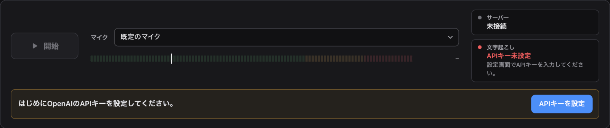

基準日: 2026-10-06・2ef89a7

# Nijimaku

OBS配信中の日本語音声をリアルタイムで文字起こしし、日本語と英訳を字幕として表示するツール。

- 文字起こし: OpenAI Realtime API（`gpt-live-transcribe`）
- 英訳: `gpt-6-luna`（以下Luna。Fast mode）。設定で、誤認識の修正と英訳を1回で行う方式にも切り替えられる
- 表示先: OBSのブラウザソースと、ChromeのDocument Picture-in-Picture（PiP）ウィンドウ

## しくみ

Chromeで開いたcapture.htmlが、マイクの音声をローカルのNodeサーバーへ送る。サーバーは無音判定で文を区切ってRealtime APIへ流し、確定した文をLunaで英訳し、overlay.html（OBS）とPiPへ送る。字幕は「途中経過（薄い色）→確定した日本語→英訳」の順に更新される（`LUNA_MODE=combined`では、確定した日本語がLunaの修正後の文に置き換わってから英訳が付く）。

## 必要なもの

- Node.js 24.12以上（Mac・Windows。Windowsの配布版では不要）
- Chrome（capture.htmlとPiP）
- OBS Studio（ブラウザソース）
- OpenAIのAPIキー（`gpt-live-transcribe`と`gpt-6-luna`を使えること）

## Windowsの配布版（ZIP）

### はじめて使うとき

[Releases](https://github.com/koguma-inc/nijimaku/releases)から`nijimaku-<版>-win-x64.zip`をダウンロードする。`nijimaku-<版>-app.zip`には`start.cmd`とNode.jsが入っていないので使わない。

1. ZIPを右クリックして「プロパティ」を開き、「全般」タブの下部にある「許可する」にチェックを入れて「OK」を押す。
   - 展開する前に行う。行わないと起動するときに警告が出る。Windows 11では起動できないこともある。
2. ZIPを右クリックして「すべて展開」を選ぶ。
3. 展開してできたフォルダを開き、`start.cmd`をダブルクリックする。
   - 黒いウィンドウが開き、少しするとChromeでNijimakuの画面が開く。
   - 警告が出たら「実行」を押す。「WindowsによってPCが保護されました」と出たら、「詳細情報」を押してから「実行」を押す。
4. 画面の「APIキーを設定」を押し、OpenAIのAPIキーを入力して「保存」を押す。
   

起動後の使い方は、画面のヘッダーの「使い方」から開ける（「セットアップ」と「起動」は開発者向けなので読まなくてよい）。

### 2回目からの起動と終了

- 起動: 展開したフォルダの`start.cmd`をダブルクリックする。
- 終了: 黒いウィンドウを閉じる。

### うまくいかないとき

- 黒いウィンドウに`node\node.exe not found`と出る: ZIPを展開せずに、ZIPの中の`start.cmd`を開いている。手順2からやり直す。
- 「ポート4649は使用中です」と出る: Nijimakuがもう起動している。ほかに黒いウィンドウが開いていないか確かめる。
- Chrome以外のブラウザが開いた: Chromeで http://localhost:4649/ を開く。

### 更新

通常は、画面に出る通知の「更新して再起動」で更新する（詳しくは画面の「使い方」）。

次のときは、全部入りZIPを今のフォルダに上書き展開する。

- 画面に「全部入りZIPを…上書き展開してください」と出たとき
- 前の版に戻したいとき

1. [Releases](https://github.com/koguma-inc/nijimaku/releases)から`nijimaku-<版>-win-x64.zip`をダウンロードし、「はじめて使うとき」の手順1と同じく「許可する」にチェックを入れる。
2. Nijimakuを止める（黒いウィンドウを閉じる）。
3. ZIPを右クリックして「すべて展開」を選び、展開先に今使っているフォルダ（`start.cmd`があるフォルダ）を指定する。同じ名前のファイルは置き換える。
4. `start.cmd`をダブルクリックして起動する。

APIキー（`credentials.json`）・設定（`settings.json`）・ログはZIPに入っていないので残る。別のフォルダに展開したときは、古いフォルダの`credentials.json`と`settings.json`を新しいフォルダへコピーする。

## セットアップ

1. 依存パッケージを入れる。`ni`を使う（ロックファイルからpnpmが選ばれる）。`ni`が無ければ`pnpm install`。
2. 次の「起動」の手順を済ませたら、Chromeで設定パネルを開き、「OpenAI APIキー」にキーを入力して「保存」を押す。`.env`の作成・編集は不要。

## 起動

```sh
nr start
```

Windowsでは`npm start`でもよい。起動すると、capture.htmlとoverlay.htmlのURLと、ログの保存先が出る。既定のポートは4649。

APIキーが未設定でもサーバーは起動する。画面からキーを保存すると、再起動せずに文字起こしと英訳へ反映される。キー未設定の間、マイクの「開始」は押せない。

## 使い方

起動後の使い方（APIキー・マイク・OBS・PiP・設定・更新・うまくいかないとき）は、capture.htmlのヘッダーの「使い方」から開くページ（`public/help.html`）にある。

開発者向けの補足:

- `scripts/replay.ts`で開始しても、入力がそちらに切り替わる（元のタブは止まる）。
- 設定パネルで変えていない表示の項目は、`public/overlay.css`の`--nm-`で始まるCSS変数の値になる。

## 設定

### OpenAI APIキー

capture.htmlの設定パネルで入力・変更・削除できる。キーはサーバー側の`credentials.json`（gitには含めない）に平文で保存し、macOSでは所有者だけが読み書きできる権限にする。保存済みのキーはブラウザに返さず、画面には設定状態と接続状態だけを表示する。APIキーを変更すると、Realtime接続を切り替え、キーを変える前の、まだ確定していない音声は捨てる。

既存の`.env`や環境変数の`OPENAI_API_KEY`も使える。画面で保存したキーが優先され、「保存したキーを削除」で`.env`か環境変数のキーへ戻る。どちらにもキーが無ければ未設定になる。配布用ZIPには`credentials.json`・`.env`・`settings.json`・`logs/`を入れない。

### 設定パネル

capture.htmlの「設定」パネルで、入力・文字起こし・表示の設定を変えられる。localhostでも、`nr share`で発行した公開URLでも使える。変えた値はすぐ反映され、サーバー側の`settings.json`（gitには含めない）に保存される。値の優先順は「パネルで保存した値 > `.env`・環境変数 > 既定値」で、項目ごとの「リセット」ボタンで`.env`・環境変数の値か既定値に戻る。各項目の使い方は`public/help.html`の「設定を変える」にある。

パネルにだけある項目:

- 配信の説明: 文字起こしの`prompt`と、Lunaの英訳の前提に使う。
- 用語集: 日本語は文字起こしの`keywords`に使う。日本語と英語の組はLunaに渡す。英語を空にした語は文字起こしにだけ使う。
- 話す言語、マイクの加工（Chromeのノイズ抑制・自動ゲイン調整・エコー除去）、字幕の大きさ・色・位置・間隔。
- 字幕のフォント: 既定はOSのフォント（Macはヒラギノ角ゴ、Windowsは游ゴシック）。Noto Sans JP・Noto Serif JPを選ぶと、MacとWindowsで同じ字形になる。NotoはGoogle Fontsから読み込むため、OBSのPCがインターネットにつながっている必要がある（つながらなければOSのフォントで出る）。`public/overlay.css`は常にGoogle FontsのCSSを読み込むので、Notoを選んでいなくてもGoogle Fontsへの通信が起きる。

「認識の待ち時間」（`delay`）を変えると、通常はRealtime接続を切り替えて反映する（切り替わるのは次に文を区切ったとき）。切り替えの途中に変えたときは、新たに切り替えず、開いている接続へ新しい値を送る（それで反映されるかは確かめていない）。それ以外の文字起こしの設定は、接続を切り替えずに反映する。マイクの加工の切り替えが使用中のマイクに反映されなければ、「停止」→「開始」で反映される。

### 環境変数

`.env`か環境変数で変える。既定値と、主な値を決めた理由は`src/config.ts`にある。`VAD_`で始まる値、`TRANSCRIBE_DELAY`、`DISPLAY_SEGMENTS`は、パネルで保存していない項目の値になる（「リセット」で戻る先）。

| 変数 | 内容 |
| --- | --- |
| `OPENAI_API_KEY` | 画面でAPIキーを保存していない場合に使うキー |
| `PORT` | 待ち受けるポート |
| `VAD_THRESHOLD_DB` | 発話とみなす音量（dBFS）。capture.htmlのメーターと同じ単位 |
| `VAD_SILENCE_MS` | 発話の後、この長さの無音が続いたら文を区切る |
| `VAD_MIN_SPEECH_MS` | これより短い音は発話とみなさない |
| `VAD_MAX_SEGMENT_MS` | 発話開始からこの長さで強制的に区切る |
| `TRANSCRIBE_DELAY` | 文字起こしの`delay`（`minimal`・`low`等） |
| `SESSION_ROTATE_MIN` | Realtime接続を切り替える間隔（分）。接続の期限（60分）より短くする |
| `LUNA_MODE` | `translate`（既定。認識結果をそのまま字幕にし、英訳だけLunaに頼む）か`combined`（Lunaが誤認識を直した日本語と英訳を1回で返す） |
| `LUNA_SERVICE_TIER` | Lunaの`service_tier`。既定は`fast`（Fast mode。単価は標準の2倍）。標準にするなら`default` |
| `LUNA_TIMEOUT_MS` | Lunaの応答を待つ上限。超えたら英訳は出さない。`combined`で修正後の日本語が未取得なら認識結果で確定する |
| `CONTEXT_SIZE` | Lunaに文脈として渡す直前の文の数 |
| `DISPLAY_SEGMENTS` | 字幕に出す文の数 |
| `SAVE_LOGS` | `1`にするとログを保存する。既定は`0`（保存しない） |

## ログ

既定では保存しない。`SAVE_LOGS=1`にすると、起動ごとに`logs/session-YYYYMMDD-HHmmss.jsonl`を作り、すべてのイベントを1件1行で書く。文字起こしの結果が平文で残るので、不要になったら手動で消す。APIキーは書かない。

## セキュリティ上の前提

- サーバーは`127.0.0.1`だけで待ち受ける。
- captureとoverlayのWebSocketは、`Origin`が`http://localhost:PORT`か`http://127.0.0.1:PORT`、または`ALLOWED_ORIGINS`（`nr share`が設定する）のページからだけ受け付ける。`Origin`の無い接続（同じPCの`replay.ts`等）は受け付ける。同じPCの他のプロセスは信頼する前提。
- 設定パネルのWebSocket（`/ws/settings`）も上と同じ`Origin`のページから受け付けるが、`Origin`の無い接続は拒否する。`Origin`のチェックは別サイトのブラウザからの操作を防ぐためのもので、利用者の認証ではない。`nr share`中は、公開URLを知る人が設定とAPIキーを変更・削除できる（保存済みのキーは読めない）。ブラウザ以外のクライアントは`Origin`を偽装できる。公開URLは信頼する相手にだけ共有する。
- APIキーの保存・削除も`/ws/settings`を使い、通常の設定の送信やログにはキーを含めない。
- 更新の適用（`update.apply`）は`http://localhost:PORT`・`http://127.0.0.1:PORT`のページからだけ受け付け、`nr share`の公開URLからは実行できない（更新の通知は公開URLのページにも出る）。
- 更新はGitHubのReleaseの`SHA256SUMS.txt`で照合する。署名はしないので、GitHubのアカウントが乗っ取られると、悪意のある更新を配られ得る。

## ライセンス

MIT（`LICENSE`）。Windowsの配布版に同梱するNode.jsと依存パッケージのライセンスは、それぞれ`node/LICENSE`と`app/versions/<版>/node_modules/`の各パッケージにある。
